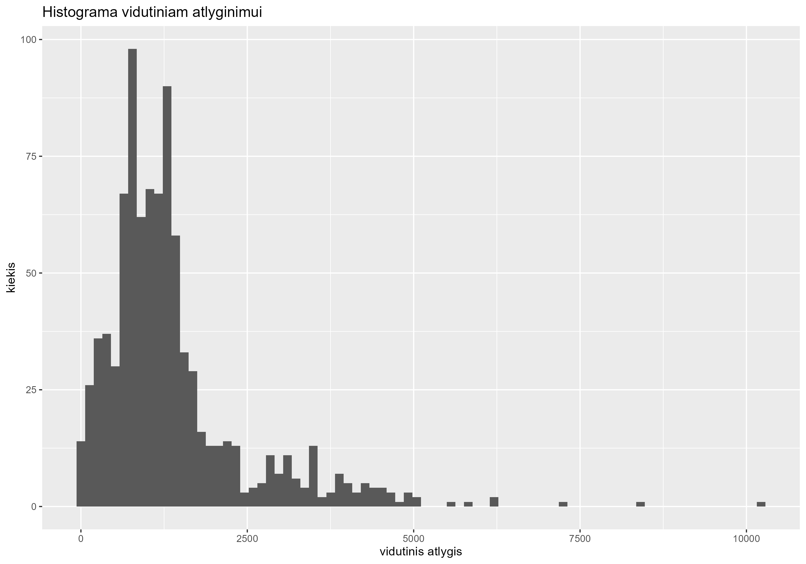
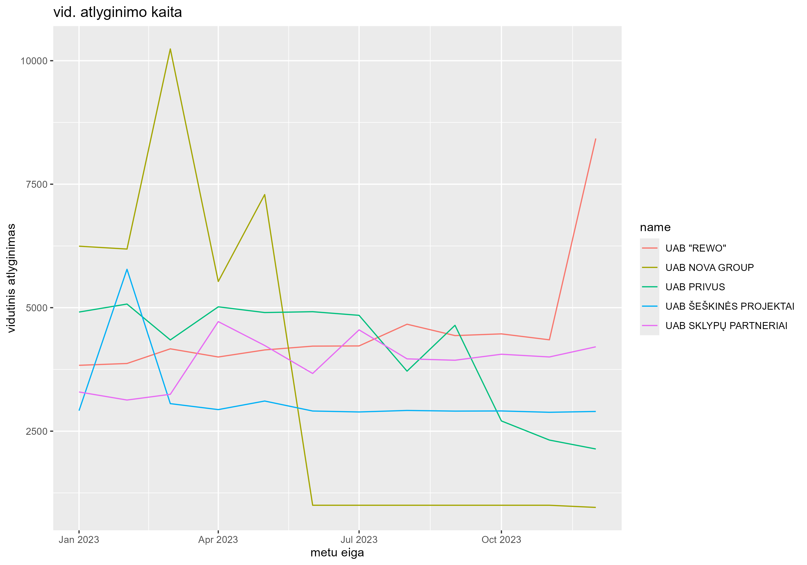
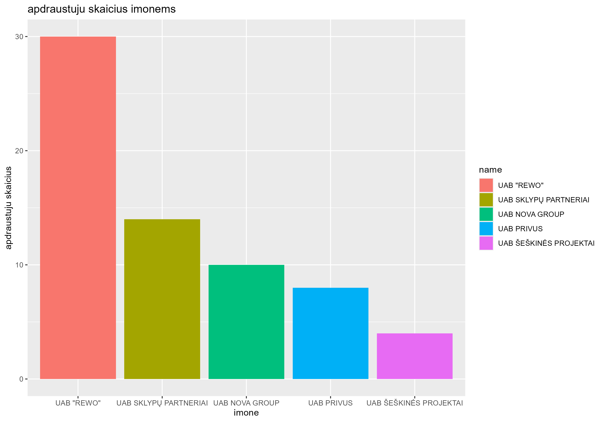
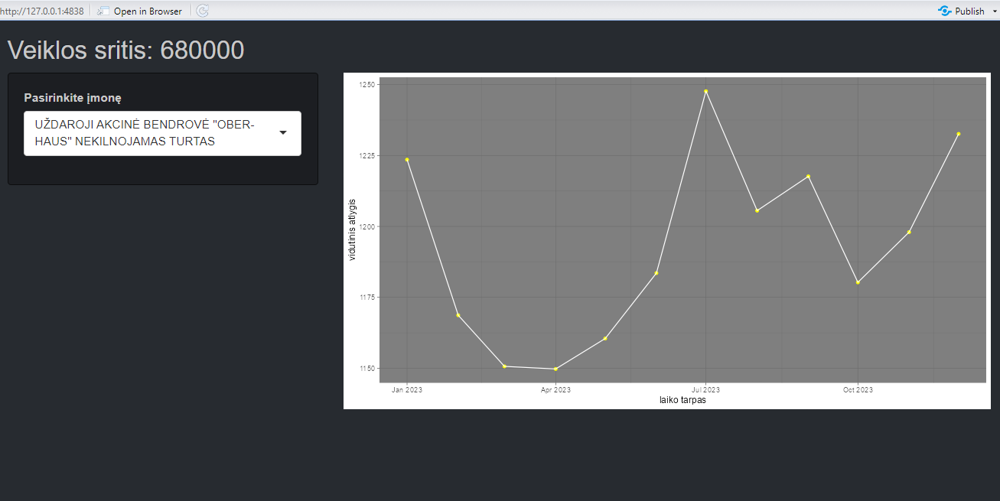

# R Laboratorinis darbas: duomenų vizualizacija

|Variantas | ecoActCode|Formatas          |
|:---------|----------:|:-----------------|
|20          |     680000     |https://atvira.sodra.lt/imones/downloads/2023/monthly-2023.json.zip|

### 2.1 Užduotis

Atsakymas:

Išvados: Didžioji dalis įmonių patenka į vidutinio Lietuvos atlyginimo spektrą, tačiau egzistuoja kelios įmonės, kurių duomenys yra išsiskiriantys ir patenka į išskirtis, t.y. stipriai nutolusias nuo kitų stebinių medianos. 

### 2.2 Užduotis

Atsakymas:

Išvados: Galime matyti, jog UAB NOVA GROUP galimai paskelbė bankrotą, kadangi vidutinis atlygis staigiai krenta ir išlieka vienoje vietoje. Įmonių, kurių grafike linija staigia krenta ar kyla, tačiau yra lygi lyg liniuotė, galima spręsti, kad tam tikrais mėnesiais trūksta duomenų, todėl programa sujungia du nutolusius taškus. Geriausiai sedėsi įmonei UAB REWO, kurios darbuotojų vidutinis atlygis metų gale pakilo daugiau nei dvigubai.

### 2.3 Užduotis

Atsakymas:

Išvados: Rezultatai yra kiekvieno įmonės vieno stebinio, t.y. kiek daugiausiai draustų darbuotojų turėjo įmonės vienu laiko tarpu. Kadangi įmonės sugeneruotos pagal darbo atlyginimą pagal didžiausią, o pvz. UAB "Šeškinės Projektai" turėjo itin mažai draustų žmonių, tad galima spręsti, jog įmonė gali būti įdarbinusi žmones, dirbančius nelegaliai, arba tai yra tiesiog kelių žmonių verslas, turintis tik kelis darbuotojus.UAB REWO darbuotojų skaičius yra didžiausias, o taip pat ir (iš antro grafiko) jų darbo vidutinis atlyginimas labai pakilo, tad galime spręsti, jog šiai įmonei 2023 sekėsi labai gerai ir ji arba plėtėsi, samdydama naujus darbuotojus, arba atleidinėjo darbuotojus ir jų atlyginimų dalis paskirstė kitiems darbuotojams, taip pakeldama vidutinį atlyginimą.

### 3. Užduotis

Shiny R aplikacijos nuotrauka:

